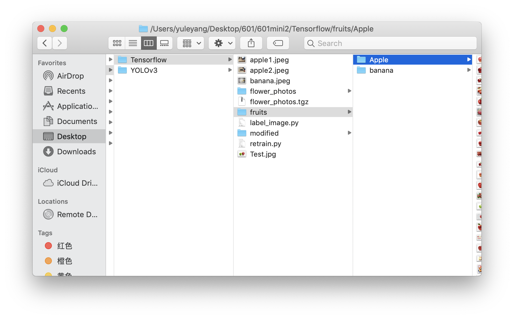
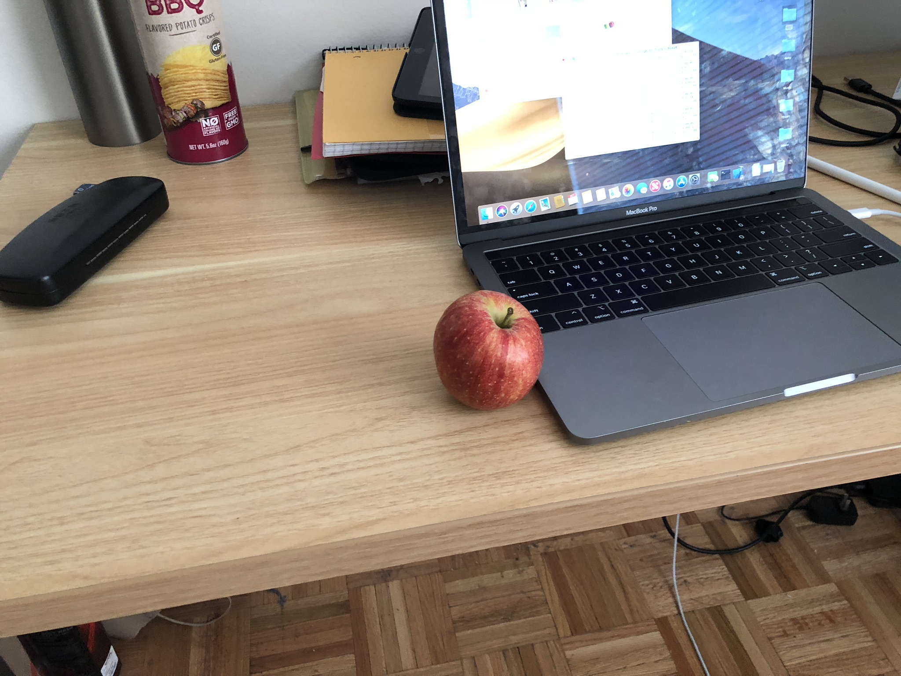
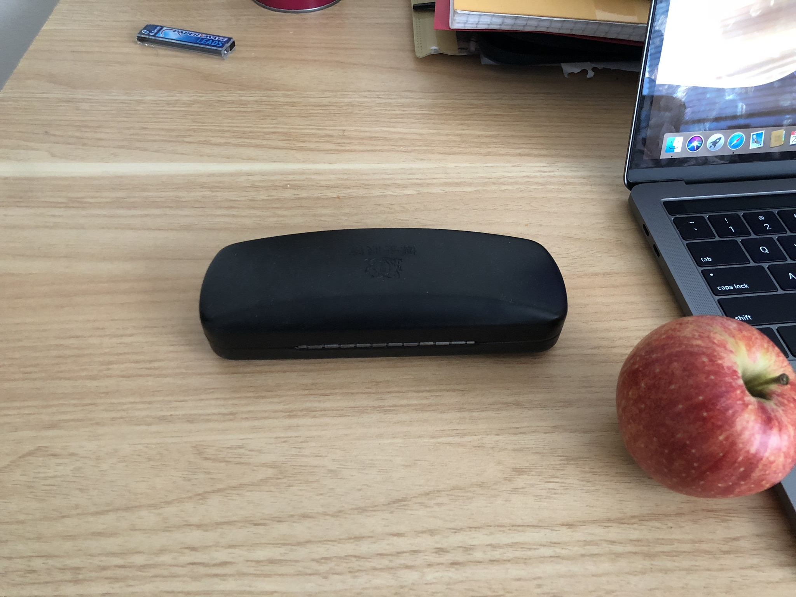
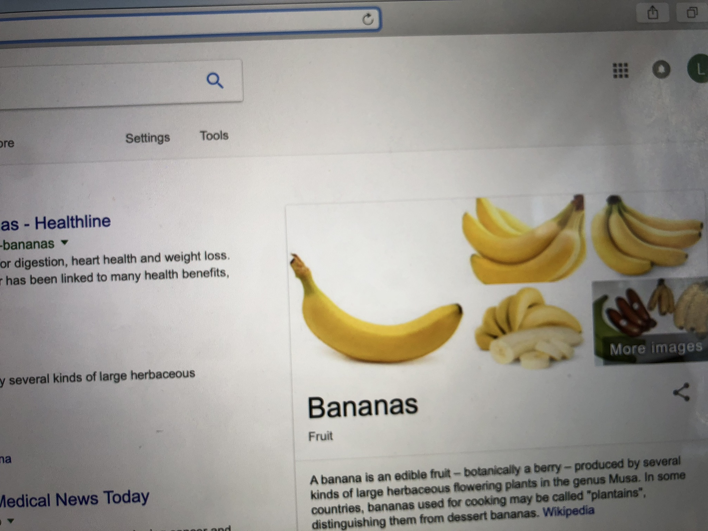
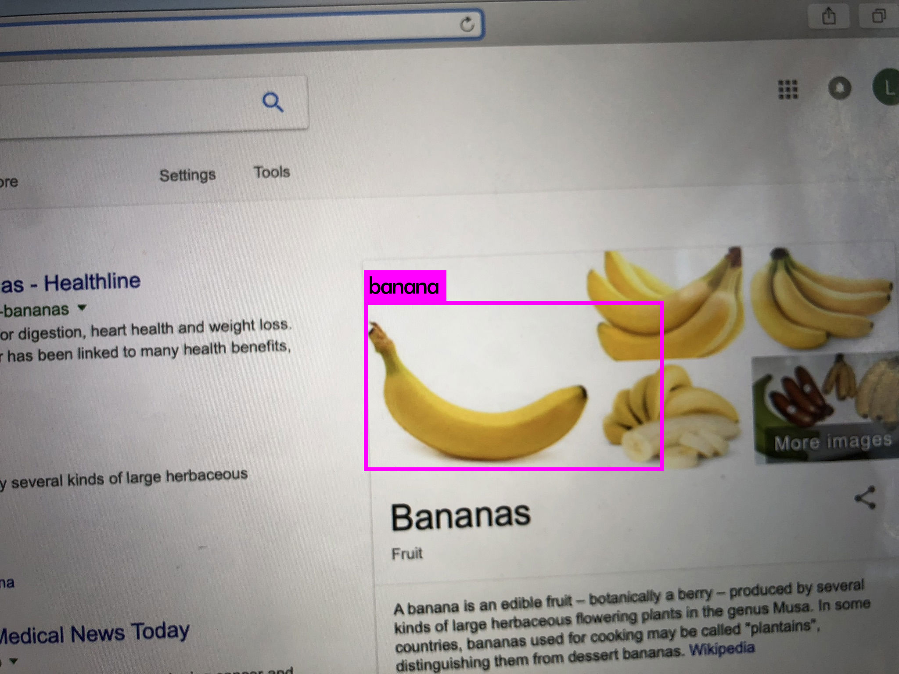
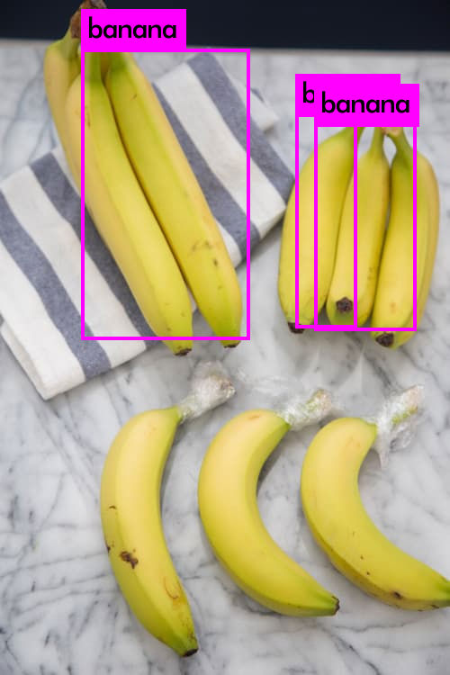

## 1 TensorFlow module
### 1.1 Prerequisites
You will need numpy, TensorFlow and TensorFlow-hub to run this retraining program, you may download it using:</br>
```$ pip install numpy```</br>
```$ pip install tensorflow```</br>
```$ pip install tensorflow-hub```</br>

Prepare your training set of images and your validation sets. I used [google-images-download](https://github.com/hardikvasa/google-images-download) to download pictures from google. You should put the images into different folders based on their categories, and the name of the folder should be the same as its category. 

You also need to download retraining module from the github of tensorflow by using pip:</br>
```
$ cd <YOUR_DESIRED_FOLDER>
$ curl -LO https://github.com/tensorflow/hub/raw/master/examples/image_retraining/retrain.py
```
</br>

You may download label_image.py from github to test your training:</br>
```
$ curl -LO https://github.com/tensorflow/tensorflow/raw/master/tensorflow/examples/label_image/label_image.py
```

### 1.2 Training and get your results
After you have downloaded all the required files above, and have your set of images ready, you can start training using:</br>
```python retrain.py --image_dir <YOUR_DIRECTION>```</br>
In this case, the data set will be automatically divided into two parts, 80% will be training data and 20% will be verification data. You can change the rate manually using: ```--testing_percentage``` and ```--validation_percentage``` .

In order to get the results of your training, you can use the label_image.py:</br>
```
python label_image.py --graph=/tmp/output_graph.pb --labels=/tmp/output_labels.txt --input_layer=Placeholder --output_layer=final_result --image=<TEST_IMAGE_PATH>
```

### 1.3 Results
For me, I chose to classificate between two kinds of fruits: apple and banana. The results is:


```
apple 0.98029584
banana 0.019704156
```


```
apple 0.9776897
banana 0.022310298
```


```
banana 0.9999838
apple 1.6182457e-05
```
## 2 YOLOv3/Darknet
### 2.1 Prerequisites 

This is how to use YOLO in LINUX and it is NOT suitable for windows.

You need to download and install Darknet to get your YOLOv3 up and ready to train:
```$ git clone https://github.com/pjreddie/darknet```</br>

Since we need to use it to train, you have better to get a computer with a Graphics. If you are using a Nvidia Graphic Card, you can download and install [CUDA](https://developer.nvidia.com/cuda-downloads) to let YOLO use your Graphics. Also, you are supposed to download and install OpenCV if you need more support for weird formats.

Once you have downloaded CUDA, open Makefile under your Darknet folder, change the first line of the Makefile to:</br>
```GPU = 1```</br>
Now you can run:</br>
```
cd <DARKNET_FOLDER>
make
```
Now your YOLO is prepared.

### 2.2 Prepare your YOLO for training

First you need your set of images, and you need to label the objects in the images using some tools. You may choose your tool as you want, and I am using [YOLO_mark](https://github.com/AlexeyAB/Yolo_mark). It can automatically generate the ```obj.names``` file, you have to create a ```yolo-obj.cfg```, and modify ```obj.data``` and ```train.txt``` according to [this page](https://github.com/AlexeyAB/darknet#how-to-train-to-detect-your-custom-objects)

You need a pre-trained weight file by running this:</br>
```wget https://pjreddie.com/media/files/darknet53.conv.74```</br>

### 2.3 Starting training

You can now start training your module by running:</br>
```./darknet detector train cfg/obj.data cfg/yolo-obj.cfg darknet53.conv.74```</br>
notice:the dir of ```obj.data```should be point to the file you modified before 
 
### 2.4 Results

I used up to 100 images of banana to train this, the results is listed below:



```
banana: 57%
```


```
banana: 92%
banana: 78%
banana: 63%
```
## 3 Comparison

# 3.1 Tensorflow

From the document of Tensorflow, I knew that this can be more flexible than I thought. During this project, the Tensorflow can automatically decide which region of the image to use to detect the object, so I don't need to label the object by myself. Also, it can automatically download the pre-trained model from internet so it is easy to use.

However, what I am using for this project is only a small part of it. In fact, it can be used for object detection by using other [modules](https://github.com/tensorflow/hub/blob/master/examples/colab/object_detection.ipynb), which can provide more abilities, but training it is not so easy.

What's more, the tiny-yolo is based on Tensorflow.

# 3.2 Darknet

The YOLOv3 is based on Darknet, and it is able to draw labels on objects. It is a little bit hard to use, mostly because it takes too much CPU and GPU to train the module and run the program. By using CUDA it can run way faster, but it still need a lot of time to complete training.
