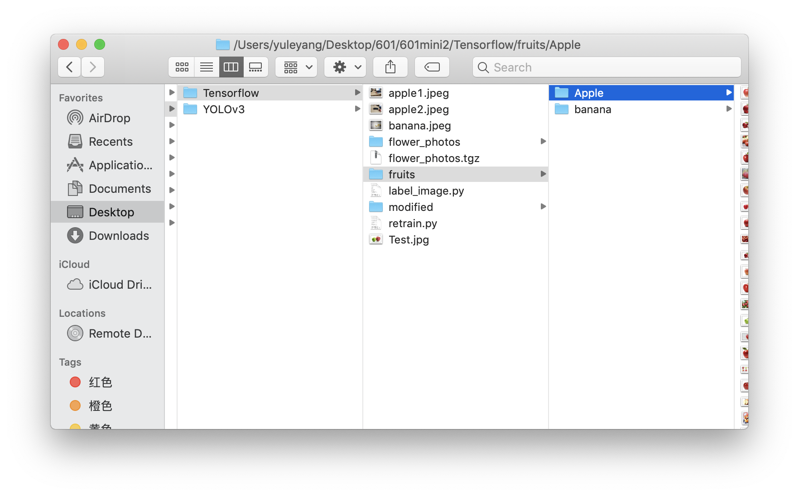
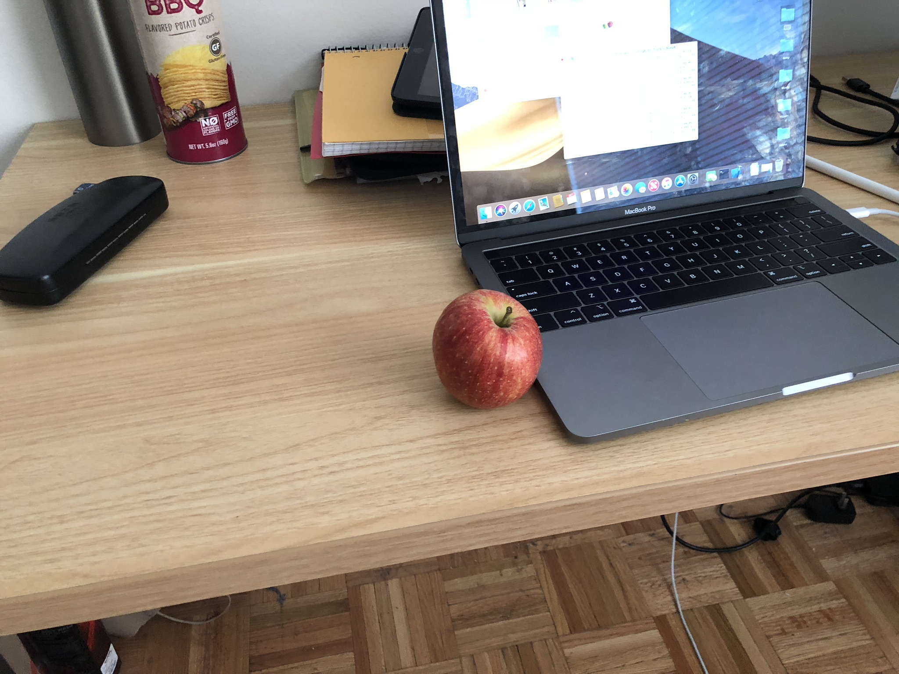
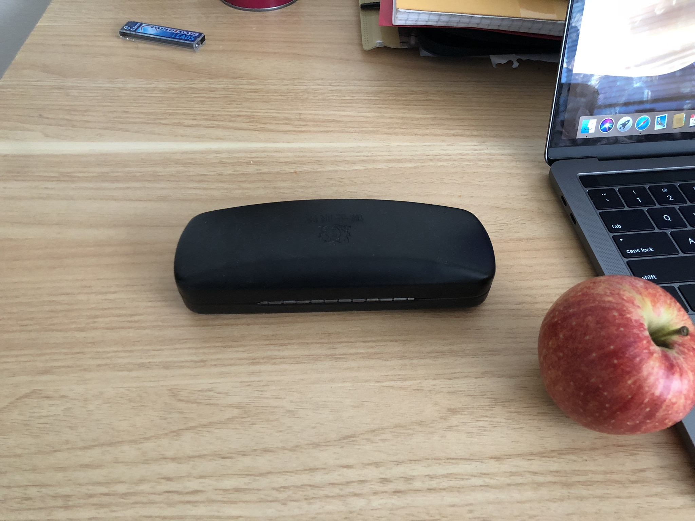
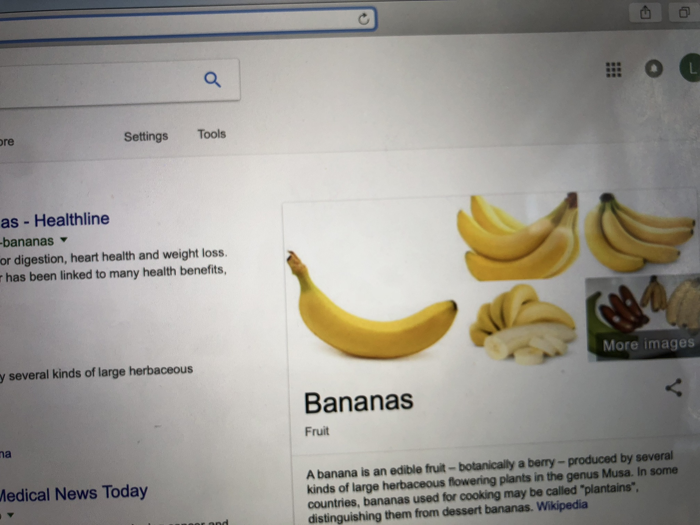

This is the TensorFlow classification module
## Steps to retrain TensorFlow module
# 1. Prerequisites
1. You will need numpy, TensorFlow and TensorFlow-hub to run this retraining program, you may download it using:<\br>
```$ pip install numpy```
```$ pip install tensorflow```
```$ pip install tensorflow-hub```

2. Prepare your training set of images and your validation sets. I used [google-images-download](https://github.com/hardikvasa/google-images-download) to download pictures from google. You should put the images into different folders based on their categories, and the name of the folder should be the same as its category. 

3. You also need to download retraining module from the github of tensorflow by using pip:
```$ cd <YOUR_DESIRED_FOLDER>```
```$ curl -LO https://github.com/tensorflow/hub/raw/master/examples/image_retraining/retrain.py```

4. You may download label_image.py from github to test your training:
```$ curl -LO https://github.com/tensorflow/tensorflow/raw/master/tensorflow/examples/label_image/label_image.py```

# 2. Training and get your results
1. After you have downloaded all the required files above, and have your set of images ready, you can start training using:
```python retrain.py --image_dir <YOUR_DIRECTION>```
In this case, the data set will be automatically divided into two parts, 80% will be training data and 20% will be verification data. You can change the rate manually using: ```--testing_percentage``` and ```--validation_percentage``` .

2. In order to get the results of your training, you can use the label_image.py:
```python label_image.py --graph=/tmp/output_graph.pb --labels=/tmp/output_labels.txt --input_layer=Placeholder --output_layer=final_result --image=<TEST_IMAGE_PATH>```

# 3. Results
For me, I chose to classificate between two kinds of fruits: apple and banana. The results is:


```
apple 0.98029584
banana 0.019704156
```


```
apple 0.9776897
banana 0.022310298
```


```
banana 0.9999838
apple 1.6182457e-05
```
# 4.Advantages and disadvantages of this method
